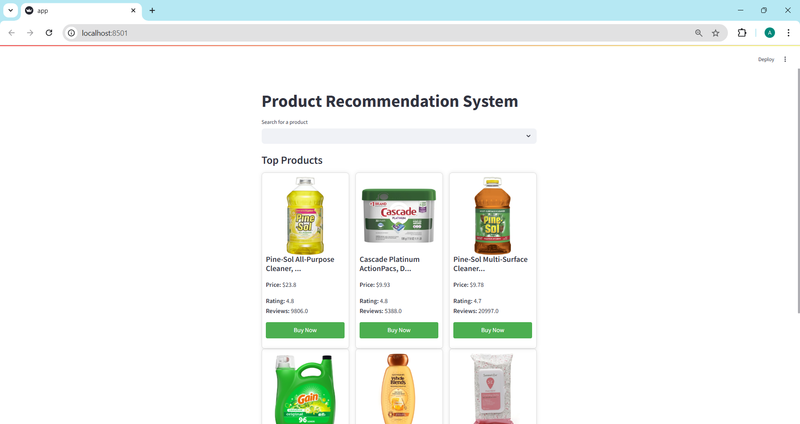
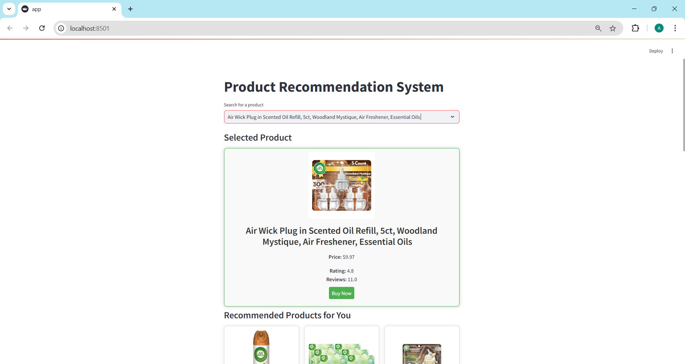
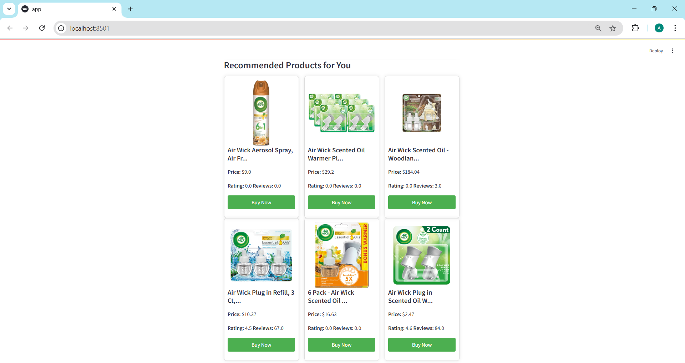

# Product Recommendation Web App

## Project Definition & Objectives

The Product Recommendation Web App is an interactive platform that offers personalized product suggestions using three approaches: base, weighted, and content-based filtering. Built with Streamlit, it combines algorithms like TF-IDF and cosine similarity to generate relevant product recommendations based on user input. The app is powered by the Walmart product review dataset, which provides a rich source of product details, ratings, and reviews to enhance the accuracy of recommendations.

This app aims to provide a seamless and intuitive user experience, presenting dynamic product recommendations tailored to individual preferences with an easy-to-use interface.

## Features

- **Multi-Approach Recommendation**: Combines base, weighted, and content-based approaches for personalized recommendations.
- **Real-Time Suggestions**: Get immediate product recommendations based on user selection.
- **Streamlit Interface**: Interactive, user-friendly web interface.
- **Responsive Design**: Displays recommendations with product images, ratings, price, and a “Buy Now” link.

## Installation

1. Clone the repository:
    ```bash
    git clone https://github.com/your-username/product-recommendation-web-app.git
    ```

2. Navigate to the project directory:
    ```bash
    cd product-recommendation-web-app
    ```

3. Run the Streamlit app:
    ```bash
    streamlit run app.py
    ```

## Usage Examples

Below are screenshots showing the functionality of the app:

- **Top Products** (based on weighted recommender):
    

- **Selected Product**:
    

- **Recommended Products**:
    

## Repository Structure
```bash
product-recommendation-web-app/
│
├── app.py                       # Streamlit app
├── walmart_recommender.py       # Python script for product recommendation function
├── walmart_recommender.ipynb    # Jupyter Notebook for product recommendation function
│
├── recommended_products.png
├── selected_product.png 
├── top_products.png
│
└── README.md
```
